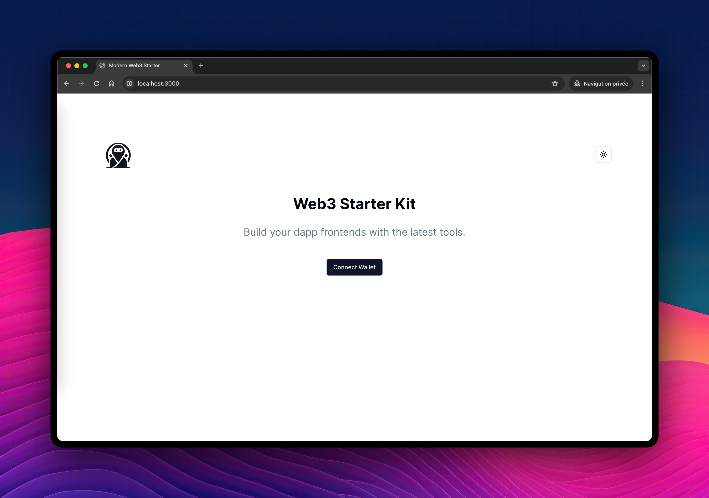

# Next.js TypeScript Starter Kit onchain



This starter kit is designed to provide a comprehensive template for building frontends for your dApps using Next.js, TypeScript, Shadcn, and Tailwind CSS. It includes setup for WAGMI React hooks and Viem for seamless onchain transactions. 

By default, this template connects to the Morph Sepolia testnet.

## 🧑‍🚀 Initial Setup

### Environment Configuration

Before you start, you need to set up your environment variables. Create a `.env.local` file in the root directory by running:

```bash
cp .env.example .env.local
```

In the file, update the `NEXT_PUBLIC_PROJECT_ID` variable with your WalletConnect project ID. You can obtain one by registering your project at [WalletConnect Cloud](https://cloud.walletconnect.com/).

### Install Dependencies 

```bash
npm install
# or
yarn 
# or
pnpm install
# or
bun install
```

### Running the Development Server

To run the development server, execute one of the following commands in your terminal:

```bash
npm run dev
# or
yarn dev
# or
pnpm dev
# or
bun dev
```

Visit [http://localhost:3000](http://localhost:3000) to see your application in action. Begin by editing `app/page.tsx` to make changes and see them reflected in real time.

## 🧞 Features

- **TypeScript**: Utilize the strong typing of TypeScript to write more robust and error-free code.
- **Tailwind CSS**: Style your application efficiently using utility-first CSS.
- **WAGMI Hooks**: Manage blockchain wallet and network interactions with ease.
- **Viem**: Handle on-chain interactions directly within your frontend application.
- **Morph Sepolia Testnet**: Connect to the Morph testnet to develop and test your dApps.

## ✨ Learning Resources

- **Morph L2**: Learn more about Morph and its capabilities by visiting [Morph Layer 2 Official Site](https://www.morphl2.io/).
- **Morph Documentation**: For detailed information on how Morph works and how to integrate it into your applications, check out the [Morph Docs](https://docs.morphl2.io/docs/how-morph-works/intro/).

## 🚀 Deployment

Deploy your application with ease using platforms like [Vercel](https://vercel.com/), which provides out-of-the-box support for Next.js applications, or [Juno](https://juno.build), which gives you full control over your dApp by enabling its deployment on Web3. Refer to platform-specific guides for details on deploying Next.js applications.
